# Архитектурные диаграммы Good Vibe Live

## 1. Общая архитектура системы

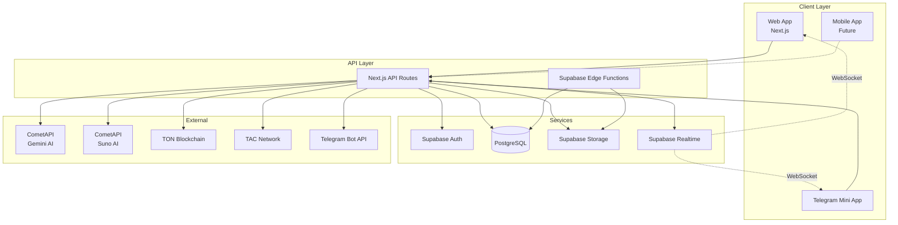

---

## 2. Схема аутентификации и данных пользователя

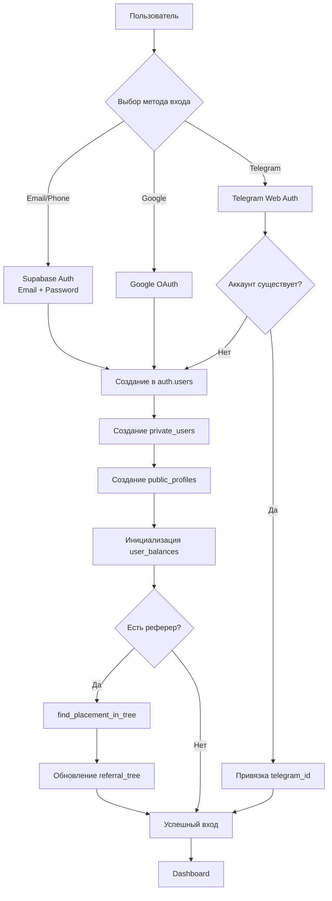

---

## 3. Жизненный цикл генерации контента

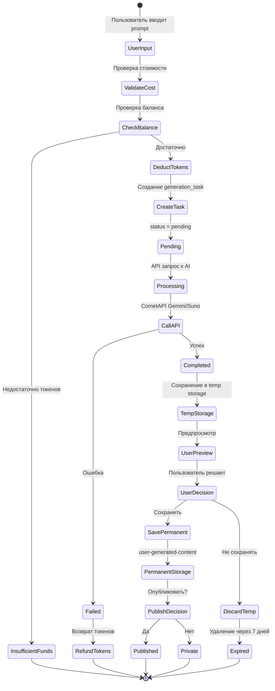

---

## 4. Реферальная система - Структура дерева

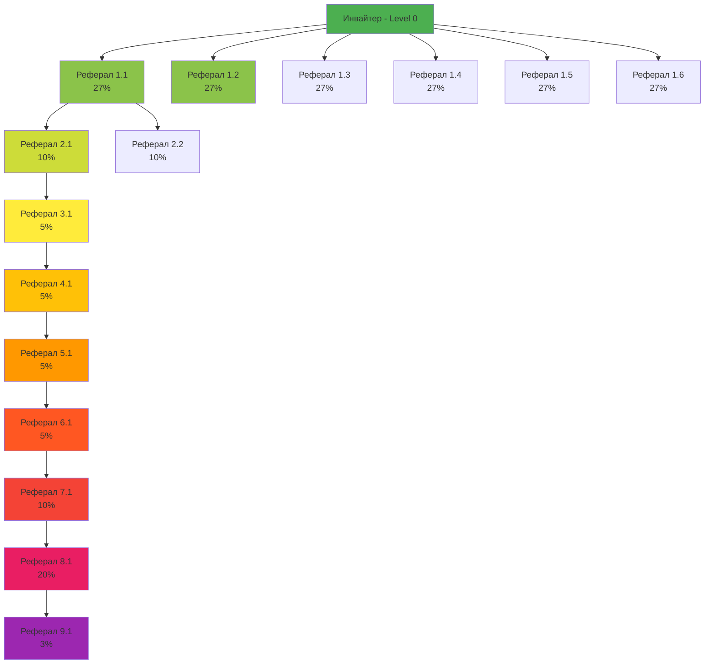

### Алгоритм размещения рефералов

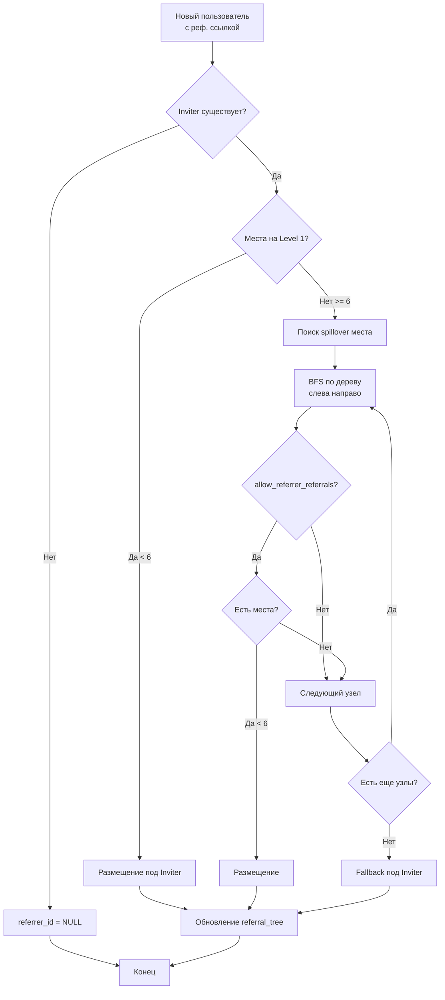

---

## 5. Система подарков - Flow диаграмма

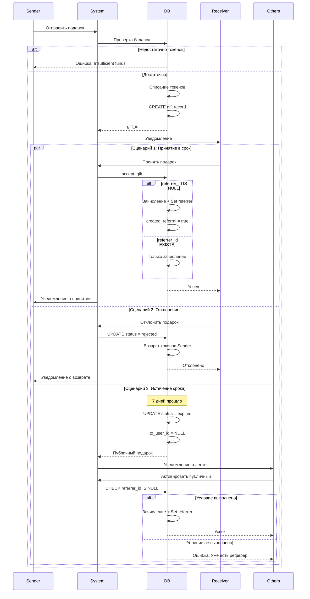

---

## 6. Распределение реферальных комиссий

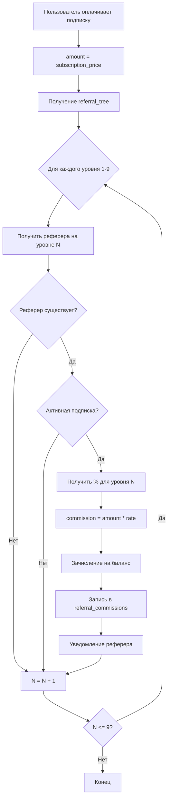

### Пример расчета комиссий

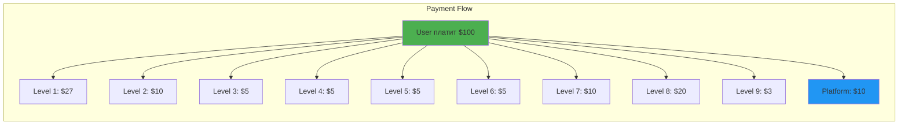

---

## 7. Database Entity-Relationship Diagram

```mermaid
erDiagram
    auth_users ||--o{ private_users : "1:1"
    auth_users ||--o{ public_profiles : "1:1"
    auth_users ||--o{ user_balances : "1:1"
    auth_users ||--o{ user_subscriptions : "1:N"
    
    subscription_tiers ||--o{ user_subscriptions : "1:N"
    
    auth_users ||--o{ referral_settings : "1:1"
    auth_users ||--o{ referral_tree : "1:N referrer"
    auth_users ||--o{ referral_tree : "1:1 referred"
    auth_users ||--o{ referral_commissions : "1:N payer"
    auth_users ||--o{ referral_commissions : "1:N receiver"
    
    auth_users ||--o{ gifts : "1:N from"
    auth_users ||--o{ gifts : "0:N to"
    
    auth_users ||--o{ generation_tasks : "1:N"
    
    auth_users ||--o{ likes : "1:N"
    generation_tasks ||--o{ likes : "1:N"
    
    auth_users ||--o{ favorites : "1:N"
    generation_tasks ||--o{ favorites : "1:N"
    
    auth_users ||--o{ follows : "1:N follower"
    auth_users ||--o{ follows : "1:N following"
    
    auth_users ||--o{ donations : "1:N from"
    auth_users ||--o{ donations : "1:N to"
    generation_tasks ||--o{ donations : "0:N"
    
    auth_users ||--o{ reminders : "1:N"
    
    auth_users {
        uuid id PK
        string email
        timestamp created_at
    }
    
    private_users {
        uuid id PK,FK
        bigint telegram_id
        string wallet_address
        uuid referrer_id FK
    }
    
    public_profiles {
        uuid id PK,FK
        string username UK
        string full_name
        string avatar_url
        boolean is_public
    }
    
    user_balances {
        uuid user_id PK,FK
        bigint balance
        timestamp updated_at
    }
    
    subscription_tiers {
        uuid id PK
        string name UK
        bigint max_storage_bytes
        int max_monthly_generations
        numeric price_monthly
    }
    
    user_subscriptions {
        uuid id PK
        uuid user_id FK
        uuid tier_id FK
        timestamp starts_at
        timestamp ends_at
        boolean is_active
    }
    
    referral_tree {
        uuid id PK
        uuid referrer_id FK
        uuid referred_id FK,UK
        int level
        timestamp created_at
    }
    
    referral_commission_rules {
        int level PK
        numeric commission_percent
    }
    
    referral_commissions {
        uuid id PK
        uuid payer_user_id FK
        uuid receiver_user_id FK
        int level
        numeric amount
        uuid subscription_id FK
        timestamp created_at
    }
    
    gifts {
        uuid id PK
        uuid from_user_id FK
        uuid to_user_id FK
        bigint amount
        string message
        string status
        timestamp created_at
        timestamp expires_at
        boolean created_referral
    }
    
    generation_tasks {
        uuid id PK
        uuid user_id FK
        int cost_in_tokens
        string provider
        string status
        string prompt
        jsonb request_metadata
        jsonb result_metadata
        string temp_storage_path
        string permanent_storage_path
        boolean is_published
        timestamp published_at
        timestamp created_at
    }
    
    likes {
        uuid user_id PK,FK
        uuid task_id PK,FK
        timestamp created_at
    }
    
    favorites {
        uuid user_id PK,FK
        uuid task_id PK,FK
        timestamp created_at
    }
    
    follows {
        uuid follower_id PK,FK
        uuid following_id PK,FK
        timestamp created_at
    }
    
    donations {
        uuid id PK
        uuid from_user_id FK
        uuid to_user_id FK
        bigint amount
        uuid task_id FK
        string message
        timestamp created_at
    }
    
    reminders {
        uuid id PK
        uuid user_id FK
        string title
        string description
        string reminder_type
        boolean is_completed
        timestamp due_date
        timestamp created_at
    }
```

---

## 8. Хранилище файлов - Структура

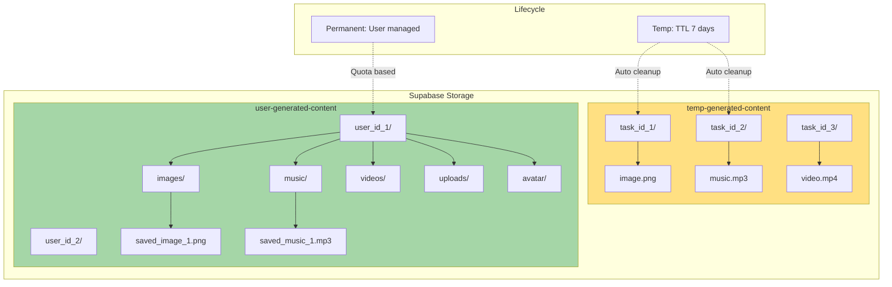

---

## 9. API Flow - Генерация изображения

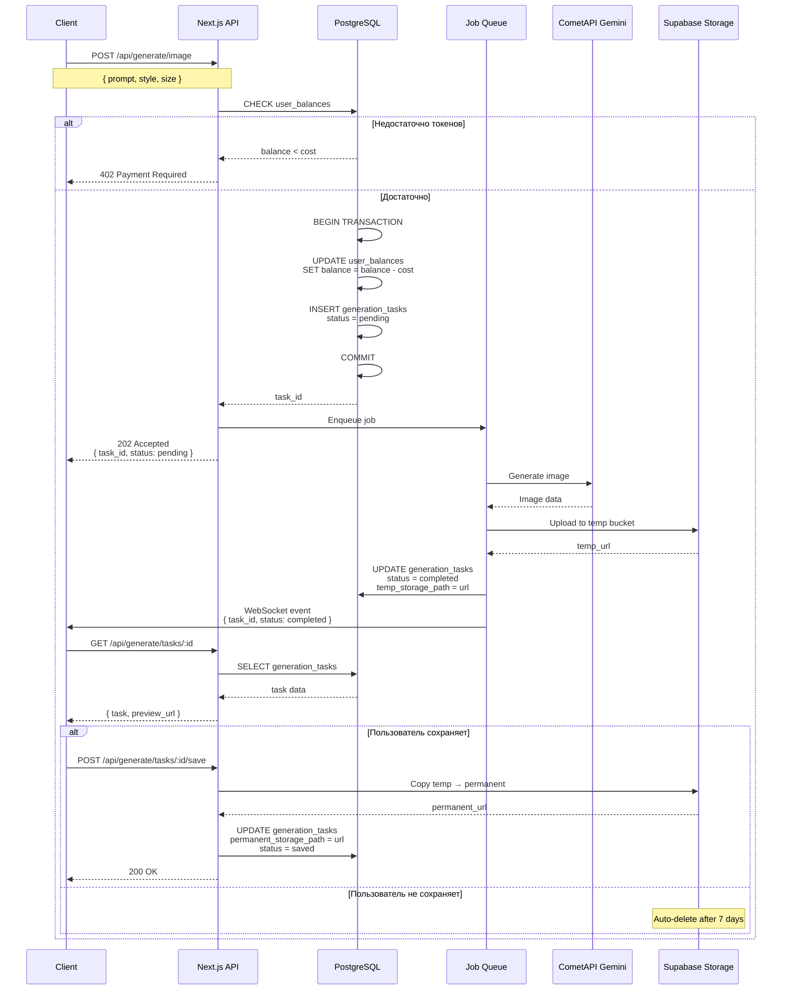

---

## 10. Deployment Architecture

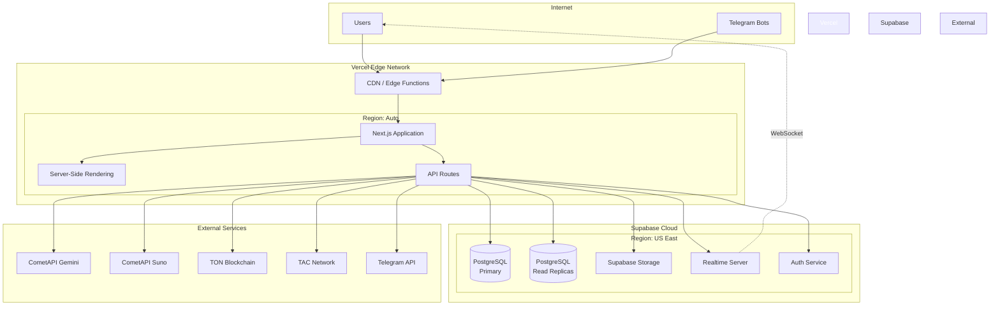

---

## 11. Security & Data Flow

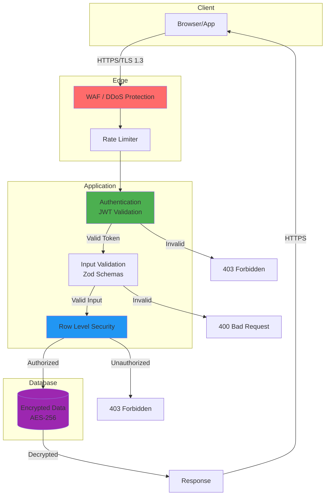

---

## 12. Monitoring & Observability Stack

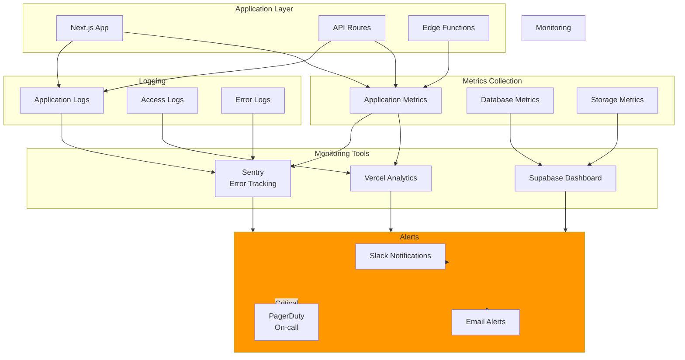

---

## Легенда

### Цветовая схема диаграмм

- 🟢 **Зелёный** - Успешные операции, активные компоненты
- 🔵 **Синий** - Сервисы, базы данных
- 🟡 **Жёлтый** - Промежуточные состояния
- 🔴 **Красный** - Ошибки, критичные компоненты
- 🟣 **Фиолетовый** - Внешние сервисы

### Типы связей

- `→` Сплошная линия - Синхронный вызов
- `-.->` Пунктир - Асинхронный вызов / WebSocket
- `==>` Жирная линия - Основной поток данных

---

## Использование диаграмм

Эти диаграммы предназначены для:

1. **Онбординг новых разработчиков** - понимание архитектуры
2. **Планирование функций** - визуализация интеграций
3. **Отладка проблем** - трассировка потоков данных
4. **Документация** - техническая спецификация
5. **Презентации** - демонстрация стейкхолдерам

Все диаграммы созданы в формате Mermaid и могут быть:
- Встроены в Markdown
- Отрендерены в GitHub/GitLab
- Экспортированы в PNG/SVG через mermaid.live
- Интегрированы в документацию (Docusaurus, VitePress и т.д.)