# Архитектурная диаграмма Good Vibe Platform

## Системная архитектура

```mermaid
graph TB
    %% User Interface Layer
    subgraph "Frontend Layer"
        WebApp["Next.js Web App<br/>React + TypeScript"]
        TelegramMini["Telegram Mini App<br/>Integration"]
        AdminPanel["Admin Panel<br/>Management Interface"]
    end

    %% Authentication
    subgraph "Authentication"
        TelegramAuth["Telegram Web Auth"]
        SupabaseAuth["Supabase Auth"]
    end

    %% API Layer
    subgraph "API Layer"
        NextAPI["Next.js API Routes"]
        SupabaseAPI["Supabase API"]
        TRPC["tRPC Endpoints"]
    end

    %% Business Logic
    subgraph "Business Logic"
        UserMgmt["User Management"]
        TokenSystem["Token System"]
        ReferralEngine["Referral Engine"]
        SubscriptionMgmt["Subscription Management"]
        GiftSystem["Gift System"]
        P2PExchange["P2P Exchange"]
    end

    %% AI Services
    subgraph "AI Services"
        ChatBot["AI ChatBot"]
        FluxImages["Flux Images"]
        MidjourneyImg["Midjourney Images"]
        Veo3Video["Veo3 Video"]
        RunwayVideo["Runway Video"]
        SoraVideo["Sora Video"]
        WanVideo["Wan Video"]
        MidjourneyVideo["Midjourney Video"]
        SunoMusic["Suno Music"]
    end

    %% Data Layer
    subgraph "Data Layer"
        PostgresDB["PostgreSQL Database<br/>Supabase"]
        Redis["Redis Cache"]
        FileStorage["File Storage<br/>Supabase Storage"]
    end

    %% Blockchain Layer
    subgraph "Blockchain Integration"
        TONConnect["TON Connect UI"]
        TACNetwork["TAC Network"]
        CryptoWallet["Crypto Wallet"]
        SmartContracts["Smart Contracts"]
    end

    %% External Services
    subgraph "External Services"
        TelegramBot["Telegram Bot API"]
        PaymentGateway["Crypto Payment Gateway"]
        AIProviders["AI Service Providers"]
    end

    %% Connections
    WebApp --> NextAPI
    TelegramMini --> NextAPI
    AdminPanel --> NextAPI

    NextAPI --> TelegramAuth
    NextAPI --> SupabaseAuth
    NextAPI --> TRPC

    TRPC --> UserMgmt
    TRPC --> TokenSystem
    TRPC --> ReferralEngine
    TRPC --> SubscriptionMgmt
    TRPC --> GiftSystem
    TRPC --> P2PExchange

    UserMgmt --> PostgresDB
    TokenSystem --> PostgresDB
    ReferralEngine --> PostgresDB
    SubscriptionMgmt --> PostgresDB
    GiftSystem --> PostgresDB
    P2PExchange --> PostgresDB

    NextAPI --> ChatBot
    NextAPI --> FluxImages
    NextAPI --> MidjourneyImg
    NextAPI --> Veo3Video
    NextAPI --> RunwayVideo
    NextAPI --> SoraVideo
    NextAPI --> WanVideo
    NextAPI --> MidjourneyVideo
    NextAPI --> SunoMusic

    ChatBot --> AIProviders
    FluxImages --> AIProviders
    MidjourneyImg --> AIProviders
    Veo3Video --> AIProviders
    RunwayVideo --> AIProviders
    SoraVideo --> AIProviders
    WanVideo --> AIProviders
    MidjourneyVideo --> AIProviders
    SunoMusic --> AIProviders

    CryptoWallet --> TONConnect
    CryptoWallet --> TACNetwork
    CryptoWallet --> SmartContracts

    TelegramAuth --> TelegramBot
    P2PExchange --> PaymentGateway

    PostgresDB --> Redis
    FileStorage --> WebApp
```

## Описание компонентов

### Frontend Layer

- **Next.js Web App**: Основное веб-приложение с React и TypeScript
- **Telegram Mini App**: Интеграция с Telegram экосистемой
- **Admin Panel**: Панель администратора для управления платформой

### Authentication

- **Telegram Web Auth**: Авторизация через Telegram
- **Supabase Auth**: Дополнительная система аутентификации

### API Layer

- **Next.js API Routes**: RESTful API эндпоинты
- **Supabase API**: Backend-as-a-Service API
- **tRPC**: Type-safe API endpoints

### Business Logic

- **User Management**: Управление пользователями
- **Token System**: Система токенов и баланса
- **Referral Engine**: Реферальная система с 8 уровнями
- **Subscription Management**: Управление подписками
- **Gift System**: Система подарков и промо-кодов
- **P2P Exchange**: Биржа для торговли токенами

### AI Services

- **AI ChatBot**: Интеллектуальный чат-бот
- **Image Generation**: Flux, Midjourney для изображений
- **Video Generation**: Veo3, Runway, Sora, Wan, Midjourney для видео
- **Music Generation**: Suno для создания музыки

### Data Layer

- **PostgreSQL**: Основная база данных через Supabase
- **Redis**: Кэширование и сессии
- **File Storage**: Хранение файлов через Supabase Storage

### Blockchain Integration

- **TON Connect UI**: Подключение TON кошельков
- **TAC Network**: Основная блокчейн сеть
- **Crypto Wallet**: Криптовалютные кошельки
- **Smart Contracts**: Смарт-контракты для операций

### External Services

- **Telegram Bot API**: Интеграция с Telegram
- **Payment Gateway**: Криптовалютные платежи
- **AI Providers**: Внешние AI сервисы
