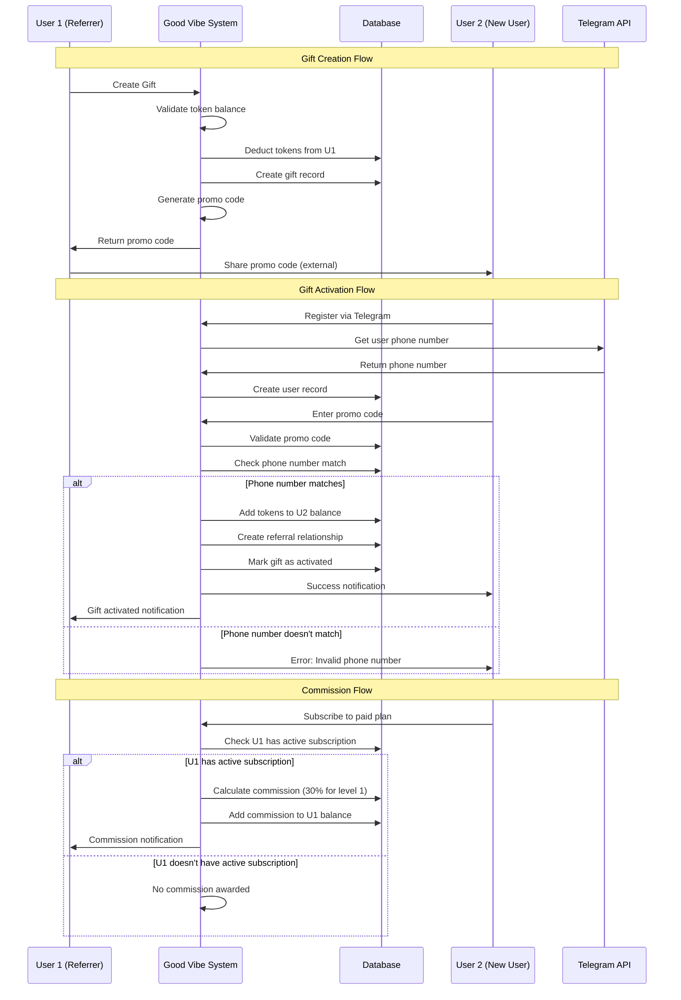

# Диаграмма потока данных: Система подарков и рефералов

## Последовательность операций

## Описание процессов

### 1. Создание подарка (Gift Creation)

1. **Пользователь 1** инициирует создание подарка
2. **Система** проверяет баланс токенов пользователя
3. **База данных** списывает токены с баланса User 1
4. **База данных** создает запись о подарке
5. **Система** генерирует уникальный промо-код
6. **Пользователь 1** получает промо-код и делится им с другом

### 2. Активация подарка (Gift Activation)

1. **Пользователь 2** регистрируется через Telegram
2. **Telegram API** предоставляет номер телефона
3. **База данных** создает профиль нового пользователя
4. **Пользователь 2** вводит полученный промо-код
5. **Система** валидирует промо-код и проверяет соответствие номера телефона
6. При успешной проверке:
   - Токены зачисляются на баланс User 2
   - Создается реферальная связь между пользователями
   - Подарок помечается как активированный
   - Отправляются уведомления обеим сторонам

### 3. Начисление комиссии (Commission Flow)

1. **Пользователь 2** оформляет платную подписку
2. **Система** проверяет наличие активной подписки у User 1
3. При наличии активной подписки у реферрера:
   - Рассчитывается комиссия (30% для первого уровня)
   - Комиссия зачисляется на баланс User 1
   - Отправляется уведомление о начислении

## Правила реферальной системы

### Структура уровней

- **Максимум 6 рефералов** на первом уровне
- **8 уровней** в реферальной сети
- **Автобалансировка**: 7-й реферал направляется к реферралу 2-го уровня с наименьшим количеством рефералов

### Проценты комиссий по уровням

- **1 уровень**: 30%
- **2 уровень**: 10%
- **3 уровень**: 5%
- **4 уровень**: 5%
- **5 уровень**: 5%
- **6 уровень**: 5%
- **7 уровень**: 10%
- **8 уровень**: 20%

### Условия начисления

- Комиссия начисляется только при **активной подписке** у реферрера
- Начисление происходит при каждой оплате подписки рефералом
- Комиссия рассчитывается от стоимости подписки в токенах

## Безопасность и валидация

### Верификация подарков

- Проверка соответствия номера телефона получателя
- Валидация уникальности промо-кодов
- Проверка достаточности баланса при создании подарка
- Защита от повторной активации одного промо-кода

### Защита от злоупотреблений

- Лимиты на количество создаваемых подарков
- Временные ограничения на активацию промо-кодов
- Мониторинг подозрительной активности
- Проверка подлинности Telegram аккаунтов
