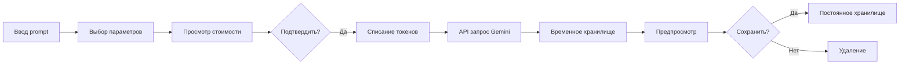
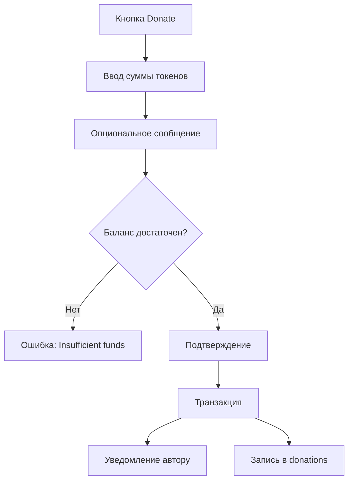
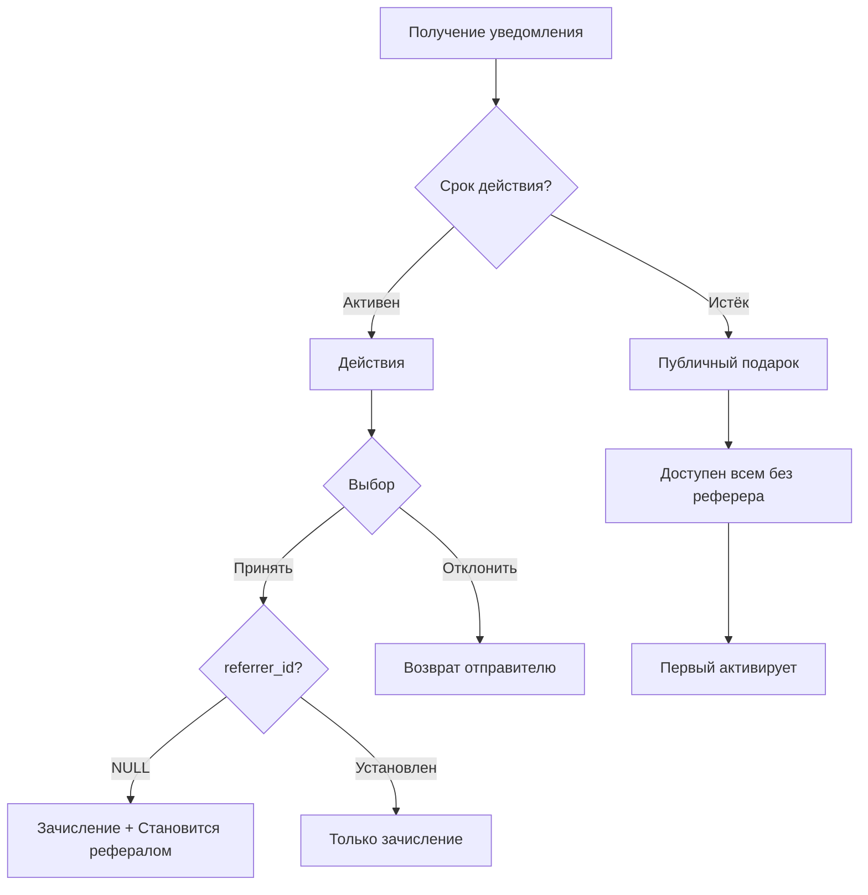

# Product Requirements Document (PRD)
# Good Vibe Live Platform

**Версия документа:** 1.0  
**Дата создания:** 17.10.2025  
**Статус:** Draft  
**Владелец продукта:** Good Vibe Live Team

---

## 📋 Executive Summary

### Краткое описание продукта
Good Vibe Live - это web3-платформа следующего поколения, объединяющая генерацию AI-контента (изображения, музыка, видео), социальные сети и децентрализованную криптовалютную экономику. Платформа предоставляет пользователям инструменты для творчества, монетизации и социального взаимодействия в едином пространстве.

### Ключевые ценности
- 🎨 **Творчество без границ**: AI-инструменты для создания профессионального контента
- 💰 **Справедливая монетизация**: Прямые выплаты авторам без посредников
- 🤝 **Социальная экономика**: Реферальная система и подарки создают сообщество
- 🔐 **Децентрализация**: Криптовалютная экономика без традиционных платежей

### Бизнес-цели
1. Достичь 10,000 активных пользователей в первые 6 месяцев
2. Конверсия в платные тарифы > 15%
3. Средний LTV пользователя > $100
4. Вирусный коэффициент K > 1.5 через реферальную систему

---

## 🎯 Product Vision & Strategy

### Vision Statement
*"Создать самую инновационную платформу для творчества, где каждый может превратить идеи в реальность с помощью AI, монетизировать свой талант и построить сообщество единомышленников"*

### Стратегические приоритеты (H1 2025)
1. **MVP Launch** - базовые функции генерации и публикации
2. **Community Growth** - реферальная система и социальные функции
3. **Monetization** - тарифные планы и токенизация
4. **Platform Stability** - надежность и производительность

### Конкурентные преимущества
- Интеграция нескольких AI-моделей в одной платформе
- Уникальная реферальная система (9 уровней)
- Telegram-first подход для простоты входа
- Web3 экономика без посредников

---

## 👥 Target Audience & User Personas

### Основные сегменты пользователей

#### 1. Креативные энтузиасты
**Демография:**
- Возраст: 18-35 лет
- Образование: Среднее специальное / Высшее
- Интересы: Искусство, дизайн, музыка, технологии

**Потребности:**
- Быстрое создание качественного контента
- Инструменты для экспериментов с AI
- Площадка для демонстрации работ

**Pain Points:**
- Дорогие AI-сервисы ($20-100/мес)
- Сложность освоения AI-инструментов
- Отсутствие аудитории для творчества

#### 2. Начинающие криптоэнтузиасты
**Демография:**
- Возраст: 20-40 лет
- Опыт с крипто: Начальный/Средний
- Платформы: Telegram активные пользователи

**Потребности:**
- Простой вход в web3
- Реальные use-case для токенов
- Дополнительный доход (passive income)

**Pain Points:**
- Сложность традиционных крипто-платформ
- Отсутствие практичных DeFi приложений
- Риски и волатильность инвестиций

#### 3. Профессиональные создатели контента
**Демография:**
- Возраст: 25-45 лет
- Опыт: Дизайнеры, музыканты, видеографы
- Доход: Ищут дополнительные источники

**Потребности:**
- Инструменты для ускорения работы
- Новые каналы дистрибуции
- Монетизация без комиссий платформ

**Pain Points:**
- Высокие комиссии маркетплейсов (20-50%)
- Сложность привлечения клиентов
- Ограничения традиционных платформ

---

## 🎨 Core Features & Requirements

### 1. Система аутентификации и профилей

#### FR-1.1: Мультивариантная аутентификация
**Приоритет:** P0 (критично для MVP)

**Требования:**
- [ ] Email + Password регистрация через Supabase Auth
- [ ] Phone + Password регистрация через Supabase Auth
- [ ] Google OAuth интеграция
- [ ] Telegram привязка к существующему аккаунту
- [ ] Telegram Mini App вход для новых пользователей

**Acceptance Criteria:**
```gherkin
Given пользователь на странице входа
When выбирает способ аутентификации (email/phone/google/telegram)
Then успешно создается аккаунт в auth.users
And создаются записи в private_users и public_profiles
And пользователь перенаправляется на dashboard
```

**Технические детали:**
- Supabase Auth для управления сессиями
- JWT токены для API
- Refresh token rotation
- Rate limiting: 5 попыток входа / 15 минут

#### FR-1.2: Публичные профили
**Приоритет:** P0

**Требования:**
- [ ] Уникальный username (валидация: 3-30 символов, a-z0-9_-)
- [ ] Avatar upload (max 5MB, formats: jpg/png/webp)
- [ ] Bio/описание (max 500 символов)
- [ ] Ссылки на соцсети (optional)
- [ ] Публичная статистика (подписчики, публикации, лайки)
- [ ] Настройка приватности (публичный/приватный профиль)

**Технические детали:**
- Avatar хранится в `user-generated-content/[user_id]/avatar/`
- Image optimization: WebP конвертация, max 512x512px
- CDN caching для публичных профилей

#### FR-1.3: Приватные данные
**Приоритет:** P0

**Требования:**
- [ ] Email (read-only, из auth.users)
- [ ] Telegram ID (опционально)
- [ ] Wallet address (опционально, TAC Network)
- [ ] Настройки уведомлений
- [ ] Настройки приватности

**RLS Policy:**
```sql
-- Только владелец или service_role
CREATE POLICY "Users can view own private data"
  ON private_users FOR SELECT
  USING (auth.uid() = id);
```

---

### 2. AI Генерация контента

#### FR-2.1: Генерация изображений (Gemini)
**Приоритет:** P0

**Требования:**
- [ ] Text-to-Image через CometAPI Gemini
- [ ] Prompt engineering интерфейс
- [ ] Параметры: стиль, размер, количество вариантов
- [ ] Preview перед сохранением
- [ ] Cost calculator (показ стоимости в токенах)

**User Flow:**


**Технические требования:**
- Timeout: 60 секунд
- Retry: до 3 попыток при ошибке
- Fallback: сохранение prompt при failure
- Webhook для async обработки

#### FR-2.2: Генерация музыки (Suno)
**Приоритет:** P1

**Требования:**
- [ ] Text-to-Music через CometAPI Suno
- [ ] Custom lyrics input (опционально)
- [ ] Выбор жанра/настроения
- [ ] Audio preview player
- [ ] Download в форматах: MP3, WAV

**Параметры генерации:**
- Duration: 30s, 1min, 3min, 5min
- Genre: 20+ категорий
- Mood: энергично, спокойно, грустно, радостно и т.д.
- Vocals: инструментал / с вокалом

**Технические требования:**
- Audio streaming для preview
- Progressive download
- Audio waveform visualization
- ID3 tags с метаданными

#### FR-2.3: Управление задачами генерации
**Приоритет:** P0

**Статусы задачи:**
- `pending` - создана, ожидает обработки
- `processing` - в процессе генерации
- `completed` - успешно завершена
- `failed` - ошибка генерации
- `saved` - сохранена пользователем
- `expired` - удалена (7 дней в temp storage)

**Требования:**
- [ ] Очередь задач с приоритетами
- [ ] Real-time статус через WebSocket/SSE
- [ ] История всех генераций
- [ ] Batch операции (re-generate, delete multiple)

---

### 3. Хранилище и управление файлами

#### FR-3.1: Временное хранилище
**Приоритет:** P0

**Требования:**
- [ ] Bucket: `temp-generated-content` (private)
- [ ] TTL: 7 дней с auto-cleanup
- [ ] Path: `/[task_id]/[filename]`
- [ ] Max size: зависит от типа (image: 10MB, audio: 50MB)

**Lifecycle Policy:**
```javascript
{
  bucket: 'temp-generated-content',
  rules: [
    {
      id: 'auto-delete-expired',
      enabled: true,
      expiration: { days: 7 },
      prefix: ''
    }
  ]
}
```

#### FR-3.2: Постоянное хранилище
**Приоритет:** P0

**Требования:**
- [ ] Bucket: `user-generated-content` (private)
- [ ] Path: `/[user_id]/[type]/[filename]`
- [ ] Quota system по тарифу
- [ ] Compression: изображения автоматически оптимизируются
- [ ] Thumbnail generation для preview

**Storage Quota:**
- Free tier: 100 MB
- Pro tier: кастомизируемо (от 1GB до 100GB)
- Overage: блокировка новых загрузок

#### FR-3.3: Загрузка пользовательских файлов
**Приоритет:** P1

**Требования:**
- [ ] Direct upload (drag & drop)
- [ ] Paste from clipboard
- [ ] Mobile camera integration
- [ ] Batch upload (до 10 файлов)
- [ ] Progress indicator

**Поддерживаемые форматы:**
- Images: JPG, PNG, WebP, GIF (max 10MB каждый)
- Audio: MP3, WAV, OGG (max 50MB)
- Video: MP4, WebM (max 500MB) - планируется

---

### 4. Публикации и социальные функции

#### FR-4.1: Создание публикаций
**Приоритет:** P0

**Требования:**
- [ ] Публикация сгенерированного контента
- [ ] Добавление описания (max 2000 символов)
- [ ] Теги/категории (max 10 тегов)
- [ ] Видимость: публично / только подписчики / приватно
- [ ] Scheduled posting (планировщик публикаций)

**Metadata структура:**
```typescript
type Publication = {
  id: UUID
  user_id: UUID
  task_id: UUID // ссылка на generation_task
  title: string
  description: string
  tags: string[]
  visibility: 'public' | 'followers' | 'private'
  published_at: timestamp
  stats: {
    views: number
    likes: number
    favorites: number
    donations_total: number
  }
}
```

#### FR-4.2: Лайки
**Приоритет:** P0

**Требования:**
- [ ] Один лайк на публикацию от пользователя
- [ ] Real-time счетчик
- [ ] Уведомление автору
- [ ] История лайков пользователя

**RLS Policy:**
```sql
-- Любой может лайкнуть, только создатель может удалить
CREATE POLICY "Anyone can like"
  ON likes FOR INSERT
  WITH CHECK (auth.uid() = user_id);

CREATE POLICY "Can remove own like"
  ON likes FOR DELETE
  USING (auth.uid() = user_id);
```

#### FR-4.3: Избранное
**Приоритет:** P1

**Требования:**
- [ ] Сохранение публикаций в коллекции
- [ ] Множественные коллекции (папки)
- [ ] Приватные по умолчанию
- [ ] Экспорт коллекции (JSON)

#### FR-4.4: Подписки (Follows)
**Приоритет:** P1

**Требования:**
- [ ] Подписка на авторов
- [ ] Notifications о новых публикациях
- [ ] Лента подписок (feed)
- [ ] Рекомендации на основе подписок

#### FR-4.5: Донаты
**Приоритет:** P1

**Требования:**
- [ ] Отправка токенов автору публикации
- [ ] Опциональное сообщение (max 500 символов)
- [ ] Public/Anonymous donation
- [ ] Топ донатеров на странице публикации

**Flow:**


---

### 5. Монетизация и токены

#### FR-5.1: Балансы пользователей
**Приоритет:** P0

**Требования:**
- [ ] Real-time баланс токенов
- [ ] История транзакций
- [ ] Категории транзакций (пополнение, списание, комиссии)
- [ ] Экспорт истории (CSV, PDF)

**Типы транзакций:**
```typescript
type Transaction = {
  id: UUID
  user_id: UUID
  type: 'deposit' | 'withdrawal' | 'generation' | 'subscription' | 
        'donation_sent' | 'donation_received' | 'commission' | 'gift'
  amount: number
  balance_after: number
  metadata: JSONB
  created_at: timestamp
}
```

#### FR-5.2: Пополнение баланса
**Приоритет:** P0

**Методы:**
1. **Telegram Wallet**
   - [ ] TON Connect UI интеграция
   - [ ] Поддержка TON, USDT (TON)
   - [ ] Автоматическая конвертация в платформенные токены

2. **TAC Network Wallet**
   - [ ] Wagmi интеграция
   - [ ] Создание кошелька в приложении
   - [ ] Список принимаемых токенов (настраивается админом)

3. **P2P Обмен** (Future)
   - [ ] Внутренняя биржа
   - [ ] Ордера купли/продажи
   - [ ] Escrow для безопасности

**Exchange Rates:**
- Обновление курсов каждые 15 минут
- Источники: CoinGecko API, Binance API
- Fallback на фиксированный курс при недоступности

#### FR-5.3: Тарифные планы
**Приоритет:** P0

**Free Tier:**
- 100 MB storage
- 20 генераций/месяц
- Watermark на изображениях
- Базовые AI модели

**Pro Tier ($9.99/мес):**
- 5 GB storage
- 500 генераций/месяц
- Без watermark
- Advanced AI модели
- Priority generation queue
- API access

**Business Tier ($29.99/мес):**
- 50 GB storage
- Unlimited generations
- Custom branding
- Dedicated support
- Team collaboration (до 5 членов)

**Технические требования:**
- [ ] Stripe/Coinbase Commerce (исключено из scope!)
- [ ] Оплата токенами платформы
- [ ] Auto-renewal подписок
- [ ] Grace period 3 дня при просрочке
- [ ] Downgrade path (сохранение данных)

---

### 6. Реферальная система

#### FR-6.1: Структура дерева
**Приоритет:** P0

**Требования:**
- [ ] 9-уровневая иерархия
- [ ] Максимум 6 рефералов на уровне 1
- [ ] Auto-placement слева направо
- [ ] Spillover на нижние уровни

**Алгоритм размещения:**
```typescript
function find_placement_in_tree(inviter_id: UUID): UUID {
  // 1. Проверка мест на уровне 1 у inviter
  const level1 = getReferrals(inviter_id, level: 1)
  if (level1.length < 6) return inviter_id
  
  // 2. Поиск first available slot (BFS)
  let queue = [...level1]
  while (queue.length > 0) {
    const node = queue.shift()
    if (!node.settings.allow_referrer_referrals) continue
    
    const refs = getReferrals(node.id, level: 1)
    if (refs.length < 6) return node.id
    
    queue.push(...refs)
  }
  
  // 3. Fallback: размещение под inviter (spillover)
  return inviter_id
}
```

#### FR-6.2: Комиссионная система
**Приоритет:** P0

**Размеры комиссий:**
| Уровень | % |
|---------|---|
| 1 | 27% |
| 2 | 10% |
| 3 | 5% |
| 4 | 5% |
| 5 | 5% |
| 6 | 5% |
| 7 | 10% |
| 8 | 20% |
| 9 | 3% |

**Условия начисления:**
- [ ] Комиссия только при активной подписке получателя
- [ ] Источник: оплата подписок рефералами
- [ ] Instant payout (не накопительная)
- [ ] Transparent история начислений

**Правила в БД:**
```sql
-- Таблица с настраиваемыми правилами
CREATE TABLE referral_commission_rules (
  level INT PRIMARY KEY CHECK (level BETWEEN 1 AND 9),
  commission_percent NUMERIC NOT NULL CHECK (commission_percent BETWEEN 0 AND 100),
  min_subscription_tier UUID REFERENCES subscription_tiers(id),
  updated_at TIMESTAMPTZ DEFAULT NOW()
);
```

#### FR-6.3: Настройки реферала
**Приоритет:** P1

**Требования:**
- [ ] `allow_referrer_referrals_registration` - разрешение spillover
- [ ] Реферальная ссылка (уникальная)
- [ ] QR код для ссылки
- [ ] Статистика дерева (активные/неактивные)
- [ ] Карта визуализации дерева

**UI Dashboard:**
- Tree view (до 3 уровней вглубь)
- Total earnings from each level
- Active vs inactive referrals
- Performance analytics

---

### 7. Система подарков

#### FR-7.1: Отправка подарков
**Приоритет:** P0

**Требования:**
- [ ] Указание получателя (username/user_id)
- [ ] Сумма токенов (min: 10, max: unlimited)
- [ ] Опциональное сообщение (max 500 символов)
- [ ] Подтверждение перед отправкой
- [ ] Списание с баланса отправителя

**Validation:**
```typescript
validateGift(from: UUID, to: UUID, amount: number): Result {
  // Проверки:
  // 1. from !== to (нельзя себе)
  // 2. amount >= 10 tokens
  // 3. balance[from] >= amount
  // 4. recipient exists (если указан)
  // 5. rate limit: max 5 gifts/hour
}
```

#### FR-7.2: Приём подарков
**Приоритет:** P0

**Workflow:**


**Логика accept_gift:**
```sql
CREATE FUNCTION accept_gift(p_gift_id UUID, p_user_id UUID)
RETURNS JSONB AS $$
DECLARE
  v_gift gifts%ROWTYPE;
  v_private_user private_users%ROWTYPE;
BEGIN
  -- 1. Lock gift row
  SELECT * INTO v_gift FROM gifts WHERE id = p_gift_id FOR UPDATE;
  
  -- 2. Validate
  IF v_gift.status != 'pending' THEN
    RAISE EXCEPTION 'Gift already processed';
  END IF;
  
  -- 3. Check expiration
  IF v_gift.expires_at < NOW() THEN
    UPDATE gifts SET status = 'expired' WHERE id = p_gift_id;
    RAISE EXCEPTION 'Gift expired';
  END IF;
  
  -- 4. Get recipient data
  SELECT * INTO v_private_user FROM private_users WHERE id = p_user_id;
  
  -- 5. Credit tokens
  UPDATE user_balances SET balance = balance + v_gift.amount WHERE user_id = p_user_id;
  
  -- 6. Set referrer if NULL
  IF v_private_user.referrer_id IS NULL THEN
    UPDATE private_users SET referrer_id = v_gift.from_user_id WHERE id = p_user_id;
    UPDATE gifts SET created_referral = true WHERE id = p_gift_id;
  END IF;
  
  -- 7. Update gift status
  UPDATE gifts SET status = 'accepted' WHERE id = p_gift_id;
  
  RETURN jsonb_build_object('success', true, 'became_referral', v_private_user.referrer_id IS NULL);
END;
$$ LANGUAGE plpgsql;
```

#### FR-7.3: Публичные подарки
**Приоритет:** P1

**Требования:**
- [ ] Автоматическое превращение в публичный через 7 дней
- [ ] Список публичных подарков в приложении
- [ ] Фильтры: по сумме, дате, отправителю
- [ ] First-come-first-serve активация
- [ ] Условие: только для пользователей с `referrer_id IS NULL`

**UI:**
- Public Gifts Feed
- Sort by: amount (desc), expiry (asc)
- One-click claim
- Countdown timer до истечения

---

### 8. Личные инструменты

#### FR-8.1: Заметки и задачи
**Приоритет:** P1

**Требования:**
- [ ] Создание заметок (type: 'note')
- [ ] Создание задач (type: 'task')
- [ ] Rich text editor для описания
- [ ] Due date для задач
- [ ] Checkbox для завершения задач
- [ ] Категории/теги

**Features:**
- Markdown support
- Checklist внутри заметок
- Прикрепление файлов (до 5MB)
- Поиск по содержимому
- Экспорт в PDF/Markdown

#### FR-8.2: Push уведомления
**Приоритет:** P1

**Типы уведомлений:**
1. **Напоминания**
   - За 1 час до due_date
   - В момент due_date
   - Повторные: через 1 час, 1 день

2. **Активность**
   - Новый лайк
   - Новый подписчик
   - Новый комментарий
   - Новый донат

3. **Финансы**
   - Получен подарок
   - Начислена комиссия
   - Оплачена подписка

4. **Система**
   - Генерация завершена
   - Низкий баланс токенов
   - Истечение подписки (за 3 дня)

**Технические требования:**
- Web Push API
- Telegram Bot notifications
- Email fallback (optional)
- Preferences: включить/выключить по типам
- Do Not Disturb режим

---

## 🔧 Technical Requirements

### Архитектура системы

#### Tech Stack
```yaml
Frontend:
  - Framework: Next.js 15.4+ (App Router)
  - Language: TypeScript 5+
  - UI Library: Radix UI Themes
  - Styling: Tailwind CSS 4
  - State: Zustand 5
  - Data Fetching: TanStack Query
  - Forms: React Hook Form + Zod
  - i18n: react-i18next

Backend:
  - Database: PostgreSQL 15+ (Supabase)
  - Auth: Supabase Auth
  - Storage: Supabase Storage
  - Functions: Supabase Edge Functions
  - Real-time: Supabase Realtime

Blockchain:
  - Wallet: TON Connect, Wagmi
  - Networks: TON, TAC
  - Signing: SIWE pattern

External Services:
  - AI: CometAPI (Gemini, Suno)
  - Telegram: Bot API, Mini Apps
  - Analytics: Vercel Analytics

DevOps:
  - Hosting: Vercel
  - CI/CD: Vercel Git Integration
  - Monitoring: Sentry (planned)
  - Logs: Supabase Logs
```

#### Database Schema (PostgreSQL)

**Core Tables:**
```sql
-- 1. Пользователи
auth.users              -- Supabase managed
private_users          -- Приватные данные
public_profiles        -- Публичные профили
user_balances          -- Балансы токенов

-- 2. Тарифы
subscription_tiers     -- Планы подписок
user_subscriptions     -- Активные подписки

-- 3. Рефералы
referral_settings      -- Настройки пользователей
referral_tree          -- Дерево рефералов
referral_commission_rules  -- Правила комиссий
referral_commissions   -- История начислений

-- 4. Подарки
gifts                  -- Таблица подарков

-- 5. Контент
generation_tasks       -- Задачи генерации
publications          -- Публикации (planned)

-- 6. Социальные
likes                 -- Лайки
favorites             -- Избранное
follows               -- Подписки
donations             -- Донаты

-- 7. Инструменты
reminders             -- Заметки и задачи
notifications         -- Уведомления (planned)

-- 8. Транзакции
transactions          -- История операций (planned)
```

**Индексы:**
```sql
-- Performance критичные индексы
CREATE INDEX idx_referral_tree_referrer ON referral_tree(referrer_id);
CREATE INDEX idx_referral_tree_referred ON referral_tree(referred_id);
CREATE INDEX idx_generation_tasks_user_status ON generation_tasks(user_id, status);
CREATE INDEX idx_gifts_to_user_status ON gifts(to_user_id, status) WHERE status = 'pending';
CREATE INDEX idx_gifts_expires_status ON gifts(expires_at, status) WHERE status = 'pending';
```

#### API Design

**REST Endpoints:**
```typescript
// Auth
POST   /api/auth/signup
POST   /api/auth/login
POST   /api/auth/telegram/link
GET    /api/auth/me

// Generation
POST   /api/generate/image
POST   /api/generate/music
GET    /api/generate/tasks
GET    /api/generate/tasks/:id
DELETE /api/generate/tasks/:id

// Publications
GET    /api/publications
POST   /api/publications
GET    /api/publications/:id
PATCH  /api/publications/:id
DELETE /api/publications/:id

// Social
POST   /api/likes
DELETE /api/likes/:id
POST   /api/follows
GET    /api/feed

// Finance
GET    /api/balance
POST   /api/deposit
GET    /api/transactions

// Referrals
GET    /api/referrals/tree
GET    /api/referrals/stats
PATCH  /api/referrals/settings

// Gifts
POST   /api/gifts
GET    /api/gifts/received
GET    /api/gifts/public
POST   /api/gifts/:id/accept
POST   /api/gifts/:id/reject
```

**WebSocket Events:**
```typescript
// Real-time updates
type WSEvent = 
  | { type: 'generation:status', task_id: UUID, status: string }
  | { type: 'balance:updated', user_id: UUID, new_balance: number }
  | { type: 'notification:new', notification: Notification }
  | { type: 'gift:received', gift_id: UUID }
  | { type: 'referral:new', referral_id: UUID }
```

### Security Requirements

#### Authentication & Authorization
- [ ] JWT token с 15 min TTL
- [ ] Refresh token rotation
- [ ] MFA support (TOTP) - Phase 2
- [ ] Session management (max 5 devices)
- [ ] IP whitelist для API (optional)

#### Data Protection
- [ ] RLS для всех таблиц
- [ ] Encryption at rest (Supabase default)
- [ ] TLS 1.3 для всех connections
- [ ] Sensitive data masking в логах
- [ ] GDPR compliance (right to deletion)

#### Rate Limiting
```typescript
const rateLimits = {
  'api/generate/*': '10 req/min per user',
  'api/auth/*': '5 req/min per IP',
  'api/gifts': '5 req/hour per user',
  'api/*': '100 req/min per user'
}
```

#### Input Validation
- [ ] Zod schemas для всех API
- [ ] SQL injection prevention (parameterized queries)
- [ ] XSS prevention (sanitize user input)
- [ ] CSRF tokens для mutations
- [ ] File upload validation (magic bytes check)

### Performance Requirements

#### Response Times
- API endpoints: < 200ms (p95)
- Page load: < 3s (p95)
- Generation tasks: < 60s (p90)
- Database queries: < 50ms (p95)

#### Scalability
- Concurrent users: 1,000 (MVP), 100,000 (Year 1)
- Database connections: pool size 20-100
- Storage: 1TB (MVP), 100TB (Year 1)
- CDN: Vercel Edge Network

#### Caching Strategy
```typescript
// Multi-layer caching
const cacheConfig = {
  // Browser
  'static assets': 'max-age=31536000, immutable',
  'public profiles': 'max-age=300, stale-while-revalidate',
  
  // CDN (Vercel)
  'api/publications': 'max-age=60, s-maxage=300',
  
  // Application (Redis planned)
  'user:balance:{id}': '60s TTL',
  'generation:task:{id}': '30s TTL'
}
```

### Monitoring & Observability

#### Metrics
- Application: Latency, Error rate, Throughput
- Business: MAU, Conversion rate, Revenue, Churn
- Infrastructure: CPU, Memory, Disk I/O, Network

#### Logging
```typescript
// Structured logging
{
  level: 'info' | 'warn' | 'error',
  timestamp: ISO8601,
  service: 'api' | 'worker' | 'function',
  user_id?: UUID,
  action: string,
  duration_ms?: number,
  metadata: object
}
```

#### Alerts
- Error rate > 1% за 5 минут
- Response time p95 > 1s за 5 минут
- Database CPU > 80% за 10 минут
- Storage usage > 90%
- Failed generations > 10% за час

---

## 📊 Success Metrics & KPIs

### Product Metrics

#### Acquisition (AARRR)
- **Sign-ups**: 500/месяц (Month 1) → 10,000/месяц (Month 6)
- **Referral Rate**: 30% users invite ≥1 friend
- **Viral Coefficient (K)**: > 1.5
- **CAC**: < $5 (organic + referral)

#### Activation
- **Time to First Generation**: < 5 минут
- **First Generation Completion Rate**: > 80%
- **Profile Completion Rate**: > 60%
- **First Publication Rate**: > 40%

#### Retention
- **D1 Retention**: > 40%
- **D7 Retention**: > 25%
- **D30 Retention**: > 15%
- **Monthly Active Users (MAU)**: Growth 20% MoM

#### Revenue
- **Free → Paid Conversion**: > 15%
- **ARPU**: > $10/месяц
- **LTV**: > $100
- **LTV/CAC Ratio**: > 3:1
- **Monthly Recurring Revenue (MRR)**: $50k (Month 6)

#### Referral
- **Referrals per User**: > 2 (average)
- **Referral Conversion**: > 30%
- **Active Referral Tree Depth**: Avg 4 levels
- **Commission Payout Volume**: > $10k/месяц

### Technical Metrics

#### Performance
- **API Response Time (p95)**: < 200ms
- **Page Load Time (p95)**: < 3s
- **Generation Success Rate**: > 95%
- **Uptime**: > 99.9%

#### Quality
- **Bug Density**: < 1 bug/KLOC
- **Test Coverage**: > 80%
- **Code Review Approval Time**: < 24 hours
- **Deployment Frequency**: Daily (hotfixes), Weekly (features)

---

## 🗓️ Timeline & Roadmap

### Phase 1: MVP (Месяцы 1-2)
**Цель:** Запуск базовой функциональности

**Week 1-2: Foundation**
- [x] Project setup (Next.js, Supabase, Tailwind)
- [ ] Authentication system (email, phone, Google)
- [ ] Database schema implementation
- [ ] Basic UI components

**Week 3-4: Core Features**
- [ ] Image generation (Gemini integration)
- [ ] Temporary storage & management
- [ ] User profiles (public/private)
- [ ] Balance system

**Week 5-6: Monetization**
- [ ] Subscription tiers
- [ ] TAC wallet integration
- [ ] Token purchase flow
- [ ] Referral system (basic)

**Week 7-8: Launch**
- [ ] Testing & bug fixes
- [ ] Performance optimization
- [ ] Deploy to production
- [ ] Marketing campaign start

**Deliverables:**
- ✅ Working platform with core features
- ✅ 100 beta users onboarded
- ✅ Positive feedback from early adopters

### Phase 2: Growth (Месяцы 3-4)
**Цель:** Масштабирование и engagement

**Week 9-10: Social Features**
- [ ] Publications system
- [ ] Likes & favorites
- [ ] Follows & feed
- [ ] Notifications

**Week 11-12: Advanced Features**
- [ ] Music generation (Suno)
- [ ] Gifts system
- [ ] Public gifts marketplace
- [ ] Reminders & tasks

**Week 13-14: Telegram Integration**
- [ ] Telegram Mini App
- [ ] Telegram Bot
- [ ] TON wallet integration
- [ ] Push notifications

**Week 15-16: Optimization**
- [ ] Advanced referral tree
- [ ] Commission automation
- [ ] Analytics dashboard
- [ ] Performance improvements

**Deliverables:**
- ✅ 1,000+ MAU
- ✅ 10% paid conversion
- ✅ Viral growth initiated

### Phase 3: Expansion (Месяцы 5-6)
**Цель:** Новые возможности и revenue streams

**Week 17-18: Content**
- [ ] Video generation
- [ ] Advanced editing tools
- [ ] Collaboration features
- [ ] Content marketplace

**Week 19-20: Economy**
- [ ] P2P token exchange
- [ ] Marketplace для товаров/услуг
- [ ] Escrow system
- [ ] Advanced analytics

**Week 21-22: Enterprise**
- [ ] Team accounts
- [ ] API for developers
- [ ] White-label option
- [ ] Custom integrations

**Week 23-24: Polish**
- [ ] Mobile app (React Native)
- [ ] Advanced AI models
- [ ] Community features
- [ ] Scale infrastructure

**Deliverables:**
- ✅ 10,000+ MAU
- ✅ $50k+ MRR
- ✅ Platform stability & scale

---

## 🚨 Dependencies & Risks

### Technical Dependencies

#### Critical Path Items
1. **Supabase Infrastructure**
   - Risk: Service downtime
   - Mitigation: Multi-region setup, backup strategy
   - Owner: DevOps team

2. **CometAPI AI Services**
   - Risk: API rate limits, service changes
   - Mitigation: Alternative providers (Replicate, Together AI)
   - Owner: Backend team

3. **TAC Network**
   - Risk: Network instability, low liquidity
   - Mitigation: Multi-chain support (TON, ETH)
   - Owner: Web3 team

4. **Telegram Integration**
   - Risk: API changes, bot restrictions
   - Mitigation: Direct WebApp fallback
   - Owner: Frontend team

### Business Risks

#### Market Risks
**Risk:** Low user adoption
- **Likelihood:** Medium
- **Impact:** High
- **Mitigation:**
  - Aggressive referral incentives
  - Content creator partnerships
  - Free tier with great UX

**Risk:** High CAC, poor unit economics
- **Likelihood:** Medium
- **Impact:** High
- **Mitigation:**
  - Organic growth via referrals
  - Community-driven marketing
  - Optimize conversion funnel

#### Regulatory Risks
**Risk:** Crypto regulations
- **Likelihood:** Medium
- **Impact:** Medium
- **Mitigation:**
  - Legal compliance review
  - KYC/AML для больших сумм
  - Готовность к pivot

**Risk:** AI content regulations
- **Likelihood:** Low
- **Impact:** Medium
- **Mitigation:**
  - Watermarking AI content
  - Content moderation
  - Terms of service защита

### Technical Risks

#### Scalability
**Risk:** Database bottleneck
- **Mitigation:** Read replicas, caching, sharding plan
- **Monitoring:** Query performance, connection pools

**Risk:** Storage costs explosion
- **Mitigation:** Aggressive cleanup, compression, CDN
- **Monitoring:** Storage growth rate, costs

#### Security
**Risk:** Token theft/fraud
- **Mitigation:** 2FA, withdrawal limits, fraud detection
- **Monitoring:** Suspicious activity, rate limits

**Risk:** Data breach
- **Mitigation:** Encryption, regular audits, bug bounty
- **Monitoring:** Security alerts, penetration tests

---

## 📋 Appendix

### Glossary

**Terms:**
- **GVL Token**: Внутренняя валюта платформы Good Vibe Live
- **Generation Task**: Задача создания AI-контента
- **Spillover**: Автоматическое размещение рефералов вниз по дереву
- **Public Gift**: Подарок, доступный всем без реферера после истечения срока
- **RLS**: Row Level Security - безопасность на уровне строк БД

### User Stories (Examples)

#### Story 1: Первая генерация
```
As a новый пользователь
I want to быстро создать изображение с помощью AI
So that я могу оценить возможности платформы

Acceptance Criteria:
- Могу ввести простой текст-промпт
- Вижу предпросмотр результата за < 30 секунд
- Могу сохранить или переделать бесплатно
- Получаю подсказки для улучшения промпта
```

#### Story 2: Приглашение друга
```
As a активный пользователь с подпиской
I want to пригласить друга и получать комиссию
So that я могу окупить свою подписку

Acceptance Criteria:
- Вижу уникальную реферальную ссылку
- Могу отправить через Telegram/WhatsApp/Email
- Получаю уведомление когда друг регистрируется
- Вижу начисление комиссии при оплате подпиской друга
```

#### Story 3: Публикация работы
```
As a креативный пользователь
I want to опубликовать свою работу
So that другие могут увидеть и оценить её

Acceptance Criteria:
- Могу добавить описание и теги
- Выбираю уровень приватности
- Вижу реакции (лайки, просмотры) в реальном времени
- Получаю донаты от тех, кому понравилось
```

### Competitive Analysis

| Feature | Good Vibe Live | Midjourney | DALL-E | Suno.ai |
|---------|---------------|------------|---------|---------|
| Image Gen | ✅ | ✅ | ✅ | ❌ |
| Music Gen | ✅ | ❌ | ❌ | ✅ |
| Video Gen | 🔜 | ❌ | ❌ | ❌ |
| Social | ✅ | ❌ | ❌ | ✅ |
| Referrals | ✅ (9 levels) | ❌ | ❌ | ❌ |
| Crypto | ✅ | ❌ | ❌ | ❌ |
| Free Tier | ✅ 100MB | ❌ | ✅ Limited | ✅ Limited |
| Collaboration | 🔜 | ✅ | ❌ | ❌ |

**Our Edge:**
1. 🎯 All-in-one platform (не нужно несколько сервисов)
2. 💰 Crypto-first экономика
3. 🤝 Viral referral system
4. 🚀 Telegram integration

---

## ✅ Acceptance & Sign-off

### MVP Definition of Done

**Must Have (P0):**
- [ ] Email/Phone/Google/Telegram authentication
- [ ] Image generation (Gemini)
- [ ] User profiles (public/private)
- [ ] Token balance & purchase
- [ ] Subscription tiers
- [ ] Basic referral system (1 level)
- [ ] Temporary storage (7 days)

**Should Have (P1):**
- [ ] Music generation (Suno)
- [ ] Gifts system
- [ ] Publications & likes
- [ ] Notifications
- [ ] Referral tree (9 levels)

**Could Have (P2):**
- [ ] Reminders & tasks
- [ ] Advanced analytics
- [ ] Mobile app
- [ ] API access

### Approval

**Stakeholders:**
- [ ] Product Owner: ____________________
- [ ] Tech Lead: ____________________
- [ ] Design Lead: ____________________
- [ ] Marketing Lead: ____________________

**Date:** ____________________

---

**Document History:**
- v1.0 - 2025-10-17: Initial PRD creation
- v1.1 - TBD: Post-MVP updates
- v2.0 - TBD: Phase 2 requirements

---

*This PRD is a living document and will be updated as the product evolves.*