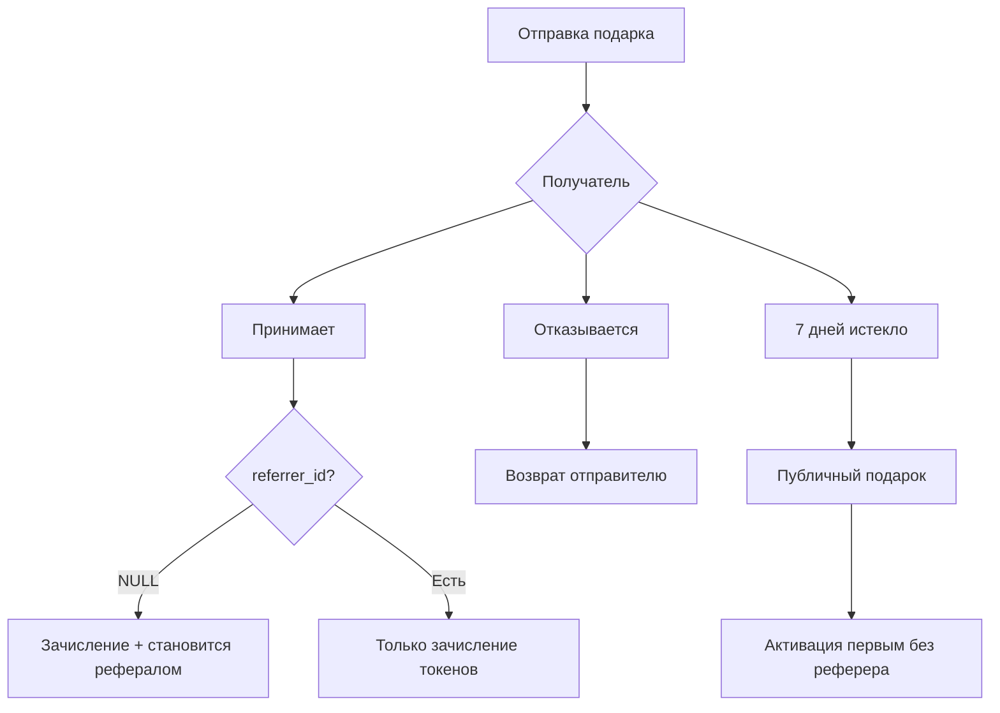
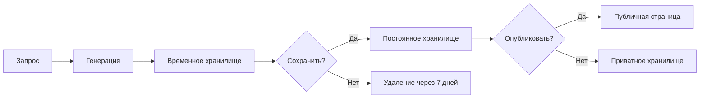

# Good Vibe Live - Структурированное описание проекта

## 📋 Обзор проекта

**Good Vibe Live** - креативная платформа для мечтателей, объединяющая генерацию AI-контента, социальные функции и криптовалютную экономику.

### Основная цель
Предоставить пользователям единую платформу для:
- Создания контента с помощью ИИ (изображения, видео, музыка)
- Редактирования и публикации творческих работ
- Монетизации контента через внутреннюю экономику
- Социального взаимодействия и сотрудничества

---

## 🏗️ Технологический стек

### Frontend
- **Framework**: Next.js 15.4.6 (React 19.1.0, TypeScript 5)
- **Styling**: Tailwind CSS 4, Radix UI Themes
- **State Management**: Zustand 5.0.7
- **Forms**: React Hook Form + Zod 3.25.76
- **Data Fetching**: TanStack React Query
- **Internationalization**: i18next (react-i18next, expo-localization)

### Backend & Infrastructure
- **Database**: PostgreSQL (Supabase)
- **Authentication**: Supabase Auth, Telegram Web Auth
- **Storage**: Supabase Storage
- **AI Services**: Gemini (изображения), Suno (музыка)
- **Blockchain**: TAC Network, TON Connect UI, Wagmi
- **Deployment**: Vercel
- **Monorepo**: Turbo

### Domains
- goodvibe.live (основной)
- goodvibelive.vercel.app (staging)

---

## 🔐 Система аутентификации

### Методы входа
1. **Email + Password** (Supabase Auth)
2. **Phone + Password** (Supabase Auth)
3. **Google OAuth**
4. **Telegram** (привязка к существующему аккаунту)

### Архитектура данных
```
auth.users (Supabase Auth)
    ↓
private_users (приватные данные)
    - email, telegram_id
    - wallet_address
    - referrer_id
    ↓
public_profiles (публичные данные)
    - username, full_name
    - avatar_url
    - is_public
```

---

## 💰 Монетизация и экономика

### Токены платформы
- **Назначение**: Оплата генерации контента, подписок, покупок
- **Пополнение**:
  - P2P биржа внутри платформы
  - Криптокошелек TAC Network
  - Telegram Wallet интеграция
  - Подарки от других пользователей

### Тарифные планы
| Тариф | Хранилище | Генерации/мес | Цена |
|-------|-----------|---------------|------|
| Free  | 100 MB    | Ограничено    | 0    |
| Pro   | Custom    | Custom        | Variable |

### Реферальная система
- **Структура**: 9 уровней, до 6 рефералов на первом уровне
- **Комиссии**: 27%, 10%, 5%, 5%, 5%, 5%, 10%, 20%, 3%
- **Условие**: Активна только при платной подписке
- **Размещение**: Автоматическое (слева направо) под рефералами с разрешением

---

## 🎁 Система подарков

### Механика
1. Пользователь A отправляет N токенов пользователю B
2. Получатель может:
   - Принять (токены + становится рефералом, если referrer_id = NULL)
   - Отказаться (возврат отправителю)
3. **Срок действия**: 7 дней
4. **Публичные подарки**: Непринятые подарки становятся доступны всем без реферера

### Бизнес-логика


---

## 🎨 Генерация и управление контентом

### AI Провайдеры
- **Изображения**: Gemini (через CometAPI)
- **Музыка**: Suno (через CometAPI)
- **Видео**: Планируется

### Жизненный цикл контента


### Storage структура
```
temp-generated-content/        # TTL 7 дней
└── [task_id]/
    └── [files]

user-generated-content/        # Постоянное
└── [user_id]/
    ├── images/
    ├── music/
    ├── videos/
    └── uploads/
```

---

## 👥 Социальные функции

### Взаимодействия
- ❤️ **Лайки**: Один клик на публикацию
- ⭐ **Избранное**: Сохранение в личную коллекцию
- 👁️ **Подписки**: Уведомления о новом контенте
- 💸 **Донаты**: Поддержка авторов токенами

### Публичные профили
- Доступны без регистрации
- Портфолио опубликованных работ
- Статистика (подписчики, лайки, просмотры)
- Кнопка "Отправить подарок"

---

## 📝 Личный инструментарий

### Заметки и задачи
```typescript
type Reminder = {
  id: UUID
  user_id: UUID
  title: string
  description?: string
  reminder_type: 'note' | 'task'
  is_completed: boolean
  due_date?: timestamp
}
```

### Push-уведомления
- Напоминания о задачах
- Новые подарки
- Активность по публикациям
- Реферальные комиссии

---

## 🗄️ Архитектура базы данных

### Основные таблицы

#### 1. Пользователи
- `auth.users` - управляется Supabase
- `private_users` - приватные данные (RLS: только владелец)
- `public_profiles` - публичная информация (RLS: чтение всем)

#### 2. Финансы
- `user_balances` - баланс токенов
- `subscription_tiers` - тарифные планы
- `user_subscriptions` - активные подписки

#### 3. Рефералы
- `referral_settings` - настройки пользователя
- `referral_tree` - дерево рефералов (до 9 уровней)
- `referral_commission_rules` - правила комиссий
- `referral_commissions` - история начислений

#### 4. Подарки
- `gifts` - таблица подарков
  - Статусы: pending, accepted, expired, claimed, rejected
  - expires_at = created_at + 7 дней

#### 5. Контент
- `generation_tasks` - задачи генерации
  - Статусы: pending, processing, completed, failed, saved, expired
  - Поля: prompt, metadata, storage_paths, is_published

#### 6. Социальные
- `likes` - лайки публикаций
- `favorites` - избранное
- `follows` - подписки
- `donations` - донаты

#### 7. Инструменты
- `reminders` - заметки и задачи

### Ключевые функции (PostgreSQL)
```sql
-- Списание токенов (атомарно)
deduct_tokens(p_user_id UUID, p_amount BIGINT)

-- Поиск места в реферальном дереве
find_placement_in_tree(p_inviter_id UUID) RETURNS UUID

-- Распределение комиссий
distribute_referral_commission(
  p_payer_id UUID, 
  p_subscription_id UUID, 
  p_amount NUMERIC
)

-- Принятие подарка
accept_gift(p_gift_id UUID, p_user_id UUID)
```

---

## 🔮 Будущие возможности

### Запланировано
- 🏪 **Маркетплейс** - продажа товаров и услуг
- 💱 **P2P биржа** - обмен токенами между пользователями
- 🎬 **Видео генерация** - расширение AI возможностей
- 🌐 **Web3 интеграция** - полноценные NFT и смарт-контракты

### Масштабируемость БД
База данных спроектирована с учетом будущих функций:
- Гибкие JSONB поля для метаданных
- Расширяемая система тарифов
- Модульная структура таблиц
- Подготовка к marketplace и trading функционалу

---

## 🚫 Исключения

**НЕ включается в платформу:**
- Оплата банковскими картами
- Банковские переводы
- Традиционные платежные системы (PayPal, Stripe и т.д.)

**Философия**: Полностью криптовалютная экономика

---

## 📊 Метрики успеха

### KPI платформы
- MAU (Monthly Active Users)
- Количество генераций контента
- Объем токенов в обороте
- Конверсия в платные тарифы
- Активность реферальной программы

### Пользовательские метрики
- Engagement Rate (лайки, комментарии, шэры)
- Retention Rate (7д, 30д)
- Средний чек подписки
- LTV пользователя

---

## 🔒 Безопасность и приватность

### Row Level Security (RLS)
- ✅ `private_users` - только владелец + service_role
- ✅ `public_profiles` - чтение всем, запись владельцу
- ✅ `user_balances` - только владелец + функции БД
- ✅ Все таблицы - CASCADE удаление при удалении пользователя

### Хранение данных
- Приватные файлы - требуют аутентификации
- Публичные публикации - открытый доступ
- Временные файлы - автоудаление через 7 дней
- Персональные данные - шифрование на уровне БД

---

## 🛠️ Инструменты разработки

### CI/CD
- Vercel auto-deploy (main → production)
- Preview deployments для PR
- Environment variables через Vercel

### Качество кода
- ESLint + Next.js plugin
- TypeScript strict mode
- Turbo для оптимизации сборки

### Мониторинг
- Vercel Analytics
- Supabase Dashboard
- Error tracking (планируется Sentry)

---

## 📚 Документация и ресурсы

### Внешние API
- [CometAPI](https://docs.comet-api.com) - AI генерация
- [Supabase Docs](https://supabase.com/docs) - Backend
- [TAC Network](https://docs.tac.build) - Blockchain
- [Telegram Bot API](https://core.telegram.org/bots) - Интеграция

### Внутренняя документация
- `/docs/claude/agents/` - AI агенты для разработки
- `/src/app/api/` - API endpoints документация
- `project-description.md` - исходное описание проекта
- `prd.md` - Product Requirements Document